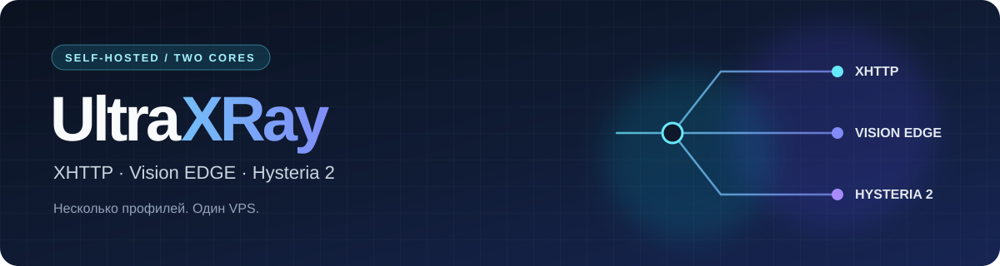
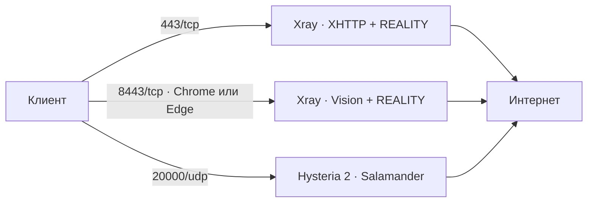

<p align="center">
  
</p>

<h1 align="center">UltraXRay</h1>

<p align="center">
  Xray REALITY и Hysteria 2 на одном VPS.<br>
  Несколько профилей подключения и установка, которая сохраняет соседние сервисы.
</p>

<p align="center">
  <a href="https://github.com/nesfe/UltraXRay/actions/workflows/check.yml"></a>
  <a href="https://github.com/nesfe/UltraXRay/releases/tag/v2026.10.01"></a>
  
  
</p>

<p align="center">
  <a href="#-быстрый-старт">Быстрый старт</a> ·
  <a href="#-профили">Профили</a> ·
  <a href="#-как-устроено">Схема</a> ·
  <a href="CHANGELOG.md">История изменений</a> ·
  <a href="docs/TROUBLESHOOTING.md">Помощь с подключением</a>
</p>

> [!IMPORTANT]
> **Уже установлен UltraXRay?** Для добавления Vision EDGE используйте генератор профиля ниже. Установщик предназначен для нового сервера и остановится, если обнаружит Xray или Hysteria.

## 🚀 Быстрый старт

| Есть работающий Vision | Нужна новая установка |
| --- | --- |
| Добавьте Edge-профиль с теми же доступами. Серверный конфиг и службы не меняются. | Подготовьте Ubuntu 22.04+ или Debian с systemd и свободными портами `443/tcp`, `8443/tcp`, `20000/udp`. |

**Добавить Vision EDGE в существующем клоне:**

```bash
git pull --ff-only
python3 scripts/add-vision-edge.py
```

Команда берёт `/root/ultraxray-vless-vision-link.txt`, выводит новую ссылку и сохраняет её в `/root/ultraxray-vless-vision-edge-link.txt`. Если установлен `qrencode`, рядом появится PNG с QR-кодом. Запускайте с доступом к исходному файлу, обычно от `root`.

**Установить на новый сервер:**

```bash
bash <(curl -fsSL https://raw.githubusercontent.com/nesfe/UltraXRay/v2026.10.01/install.sh)
```

Установщик спросит домен для REALITY и пароль Hysteria 2. Пустой пароль будет создан автоматически. Перед запуском нужны права `root` и утилита `ss` из пакета `iproute2`.

<details>
<summary><strong>Другой путь к Vision-ссылке или только вывод в терминал</strong></summary>

```bash
python3 scripts/add-vision-edge.py /path/to/vision-link.txt --output-dir /path/to/output
python3 scripts/add-vision-edge.py /path/to/vision-link.txt --print-only
```

Исходная ссылка и серверные доступы сохраняются. Без существующего Vision-профиля генератор сообщит об ошибке: он не создаёт серверный inbound.
</details>

## 🧭 Профили

| Профиль | Сеть | Когда выбрать |
| --- | --- | --- |
| **XHTTP + REALITY** | `443/tcp` | Основной VLESS-профиль с XHTTP и VLESS Encryption. Нужен клиент с поддержкой обоих параметров. |
| **Vision + REALITY** | `8443/tcp` | VLESS Vision с TLS fingerprint `chrome`. |
| **Vision EDGE + REALITY** | `8443/tcp` | Тот же Vision с TLS fingerprint `edge`: вариант для сетей, где начальный обмен с `chrome` зависает. |
| **Hysteria 2 + Salamander** | `20000/udp` | Независимый UDP-профиль с одним портом. |

**Vision и Vision EDGE используют один серверный вход:** UUID, REALITY-ключ, shortId, SNI и порт совпадают. Дополнительная ссылка меняет `fp=chrome` на `fp=edge` и название профиля. В одной проверенной сети Edge помог при зависании соединения; источник обрыва Chrome точно не установлен, поэтому результат в других сетях может отличаться.

## 🔀 Как устроено



Xray и Hysteria работают как отдельные службы. Новая установка использует **Xray 26.6.27** и **Hysteria 2.12.3**. Эти версии закреплены для воспроизводимости проверенных профилей; обновления Xray требуют повторной проверки совместимости REALITY-клиентов.

### Соседние сервисы

Установщик не удаляет Docker, Amnezia и Outline, не очищает `iptables`/`nftables` и не завершает процессы ради освобождения порта. При существующей установке или занятом порту он остановится до установки пакетов. Активный UFW получит только правила для трёх портов UltraXRay; выключенный UFW останется выключенным.

В новых установках Hysteria слушает только `20000/udp`. Старые серверы могут по-прежнему использовать диапазон `20000–50000/udp`: публикация новой версии не меняет их конфигурацию.

<details>
<summary><strong>Куда сохраняются конфигурация, ссылки и QR-коды</strong></summary>

| Что | Путь |
| --- | --- |
| Xray | `/usr/local/etc/xray/config.json` |
| Hysteria и сертификат | `/etc/hysteria/` |
| Параметры доступа | `/root/ultraproxy.env` |
| Vision EDGE | `/root/ultraxray-vless-vision-edge-link.txt` |
| Остальные ссылки и QR | `/root/ultraxray-*-link.txt`, `/root/ultraxray-*-qr.png` |

Ссылки и `ultraproxy.env` содержат доступы. Сохраняйте их вне публичных репозиториев. Для самоподписанного сертификата Hysteria официальный URI включает `pinSHA256`; проверьте, что выбранный клиент действительно использует этот pin.
</details>

<details>
<summary><strong>Проверка служб и соединения</strong></summary>

```bash
systemctl status xray hysteria-server.service
journalctl -u xray -u hysteria-server.service -n 80 --no-pager
ss -lntup
```

Повторно вывести ссылки в локальном клоне:

```bash
bash scripts/generate-links.sh /root/ultraproxy.env
```

Диагностический скрипт `scripts/diagnose-server.sh` также выводит секретные ссылки: удалите их перед публикацией результатов.
</details>

## 📚 Подробнее

| Документ | Содержание |
| --- | --- |
| [История изменений](CHANGELOG.md) | Что вошло в релиз 2026.10.01 |
| [Архитектура](docs/ARCHITECTURE.md) | Как работают два ядра и четыре профиля |
| [Установщик](docs/INSTALLER_FLOW.md) | Порядок действий и проверки конфликтов |
| [Клиентские профили](docs/CLIENT_PROFILES.md) | Параметры ссылок и импорт |
| [Решение проблем](docs/TROUBLESHOOTING.md) | Логи, подключение и маршрутизация |
| [Источники](docs/SOURCES.md) | Документация Xray и Hysteria |

<sub>Проверки проекта: <code>python3 -m unittest discover -s tests -v</code> и GitHub Actions. Полная установка пакетов на чистой Ubuntu в рамках релиза 2026.10.01 не проверялась.</sub>
